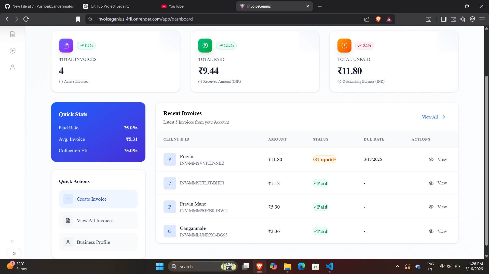
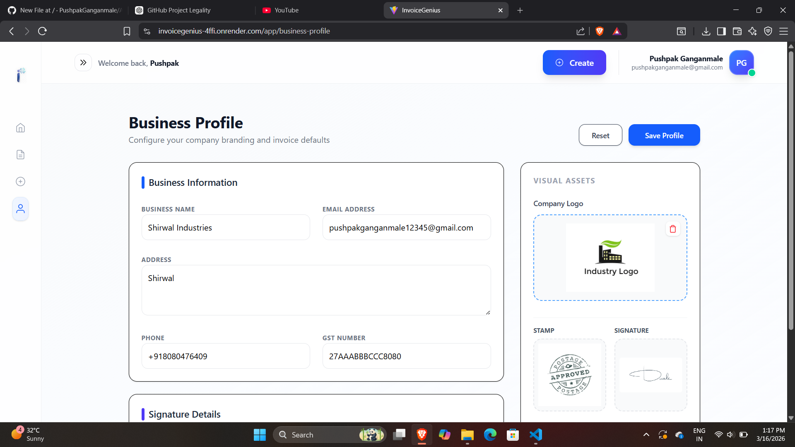
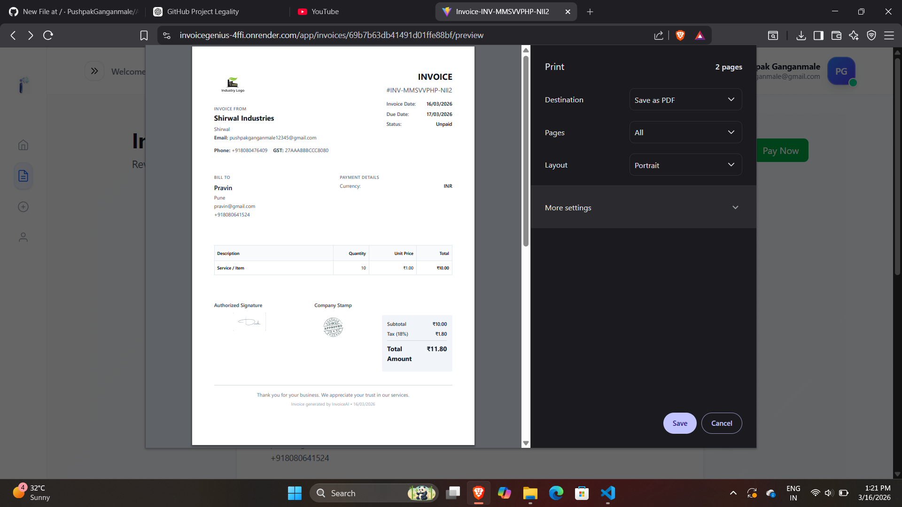
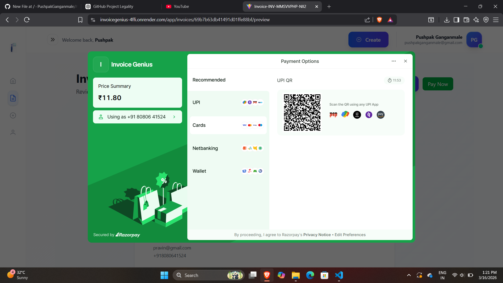

# 🚀 AI Invoice Generator using MERN + Razorpay + AI

---

# 📘 Contents

- About the Project
- Features
- Tech Stack
- Architecture
- Screenshots
- Live Demo
- Installation
- Environment Variables
- Run Locally
- Folder Structure
- Future Improvements
- Author

---

# ⭐ About the Project

**AI Invoice Generator** is a full-stack SaaS web application that helps freelancers and businesses create professional invoices easily.

Users can:

- Create and manage invoices
- Automatically calculate tax and totals
- Accept online payments
- Store business profile details
- Add logo, signature, and stamp
- Generate invoice descriptions using AI

This project demonstrates a **complete MERN stack application integrated with AI and payment systems.**

---

# ✨ Features

## 🎨 Frontend

- Modern UI using **React.js**
- Styled with **TailwindCSS**
- Fully responsive design
- Clean dashboard
- Live invoice preview
- Business profile management

---

## 🧾 Invoice Management

Users can:

- Create invoices
- Edit invoices
- Delete invoices
- Automatically calculate totals
- Track invoice status
- PDF export

Invoice statuses include:

```
draft
unpaid
partially_paid
paid
overdue
```

---

## 💳 Online Payments

Integrated with **Razorpay** to enable secure online payments.

Features:

- Create payment orders
- Pay invoices directly
- Track payment status
- Update payment records

---

## 🧠 AI Features

AI powered features using **GROQ API**

- AI generated invoice descriptions
- Smart item suggestions
- AI assisted invoice creation

---

## 🏢 Business Profile

Users can configure their business information:

- Business name
- GST number
- Address
- Contact details
- Company logo
- Signature
- Stamp

These automatically appear on invoices.

---

# 🧰 Tech Stack

| Layer | Technologies |
|------|-------------|
| Frontend | React.js, TailwindCSS |
| Backend | Node.js, Express.js |
| Database | MongoDB |
| Authentication | Clerk |
| Payments | Razorpay |
| AI | GROQ API |
| Tools | Git, GitHub, Render |

---

# 🧱 Architecture

```
Frontend (React + Tailwind)

⬇ REST API

Backend (Node + Express)

⬇

Database (MongoDB)

⬇

Payment Layer (Razorpay)

⬇

AI Layer (GROQ)
```

---

# 🖼 Screenshots

| Dashboard | Bussiness Profile | Invoice | Payment |
|-----------|-------------------|---------|---------|
|  |  |  | 

---

# 🌐 Live Demo

Frontend

```
https://invoicegenius-4ffi.onrender.com
```

Backend

```
https://invoicegenius-backend.onrender.com
```

---

# 🔧 Installation

Clone the repository

```bash
git clone https://github.com/PushpakGanganmale/ai_invoice_generator.git
cd ai_invoice_generator
```

Install dependencies

```bash
cd frontend
npm install

cd ../backend
npm install
```

---

# 🔑 Environment Variables

Create `.env` file inside the **server** folder.

```
PORT=4000

MONGO_URI=your_mongodb_connection_string

RAZORPAY_KEY_ID=your_key
RAZORPAY_KEY_SECRET=your_secret

GROQ_API_KEY=your_groq_key

CLERK_SECRET_KEY=your_clerk_key
```

---

# ▶ Run Locally

Start backend

```bash
cd backend
npm run dev
```

Start frontend

```bash
cd frontend
npm run dev
```

Open the application

```
http://localhost:5173
```

---

# 📂 Folder Structure

```
ai_invoice_generator
│
├── client
│   ├── src
│   └── public
│
├── server
│   ├── controllers
│   ├── routes
│   ├── models
│   ├── middleware
│   └── config
│
└── README.md
```

---

# 🧪 Future Improvements

- Recurring invoices
- Email invoice sending
- Invoice analytics dashboard
- Multi-currency support
- Invoice templates
- Team collaboration

---

# 👨‍💻 Author

**Pushpak Ganganmale**

GitHub  
https://github.com/PushpakGanganmale

LinkedIn  
https://www.linkedin.com/in/pushpak-ganganmale-187814219/

---
